<div align="center">

<!-- ─────────────────────────  HEADER  ───────────────────────── -->



<br/>



<br/>

<a href="https://servio-0.web.app/"></a>
<a href="https://www.linkedin.com/in/kumud-ranjan-490258399/"></a>
<a href="https://x.com/STARSAVER6127"></a>
<a href="mailto:kumudranjan6127@gmail.com"></a>

</div>


## ◢ About

I build **systems that keep running after I close the laptop** — hyperlocal delivery
infrastructure, content pipelines nobody has to click, and voice agents that stay inside
their sandbox. Most of my work lives at the seam where a clean API meets a real deadline.

```ts
const kumud = {
  role:   "Full-Stack Engineer",
  focus:  ["production platforms", "AI agents", "hands-off automation"],
  stack:  ["TypeScript", "Python", "Next.js", "Fastify", "Prisma", "Expo"],
  method: "Spec first, contracts second, code third.",
  belief: "A system you have to babysit isn't finished.",
} as const;
```

<table>
<tr>
  <td width="140"><b>▸ Building</b></td>
  <td><a href="https://github.com/kumudranjan6127-debug/Medirush"><b>Medirush</b></a> — licensed hyperlocal pharmacy platform, one Fastify API serving a PWA, an ops panel, and a driver app off a shared contracts package.</td>
</tr>
<tr>
  <td><b>▸ Automating</b></td>
  <td><a href="https://github.com/kumudranjan6127-debug/servio-social"><b>servio-social</b></a> — Gemini writes it, Buffer ships it, GitHub Actions fires at 09:00 IST. Nobody in the loop.</td>
</tr>
<tr>
  <td><b>▸ Exploring</b></td>
  <td><a href="https://github.com/kumudranjan6127-debug/JARVIS"><b>JARVIS</b></a> — offline speech and allowlist-gated agent execution. Your voice never leaves the machine.</td>
</tr>
<tr>
  <td><b>▸ Open to</b></td>
  <td>Collaboration on ambitious product engineering — especially anything with hard latency or safety constraints.</td>
</tr>
</table>


## ◢ Tech Stack

<table>
<tr>
  <td width="150" valign="middle"><b>Languages</b></td>
  <td valign="middle">
    
    
    
    
  </td>
</tr>
<tr>
  <td valign="middle"><b>Frontend</b></td>
  <td valign="middle">
    
    
    
    
    
    
    
  </td>
</tr>
<tr>
  <td valign="middle"><b>Backend</b></td>
  <td valign="middle">
    
    
    
    
    
  </td>
</tr>
<tr>
  <td valign="middle"><b>Data</b></td>
  <td valign="middle">
    
    
    
  </td>
</tr>
<tr>
  <td valign="middle"><b>Infra &amp; Tooling</b></td>
  <td valign="middle">
    
    
    
    
    
  </td>
</tr>
<tr>
  <td valign="middle"><b>AI</b></td>
  <td valign="middle">
    
    
    
  </td>
</tr>
</table>


## ◢ Selected Work

<table>
<tr>
<td width="50%" valign="top">

### [◈ Medirush](https://github.com/kumudranjan6127-debug/Medirush)
40-minute medicine & supplement delivery on a licensed, hyperlocal dark-store model (≤5 km). Turborepo monorepo splitting one Fastify API from a customer PWA, an ops panel, and a driver app — with a shared contracts package as the single source of truth.

`Fastify 5` `Prisma 6` `Next.js` `Expo` `Socket.io` `pg-boss`

</td>
<td width="50%" valign="top">

### [◈ JARVIS](https://github.com/kumudranjan6127-debug/JARVIS)
A personal AI assistant for Windows that listens, answers aloud, and safely controls applications. Speech never leaves the machine, and every action passes a kernel-level allowlist. 132 tests passing.

`Python 3.12` `Offline STT/TTS` `Allowlist Sandbox`

</td>
</tr>
<tr>
<td width="50%" valign="top">

### [◈ servio-social](https://github.com/kumudranjan6127-debug/servio-social)
Fully autonomous social media for Servio. Gemini writes the posts, Buffer publishes them, GitHub Actions fires daily at 09:00 IST — and a secret-scanning workflow guards the pipeline. Nobody clicks anything.

`TypeScript` `GitHub Actions` `Gemini` `Buffer`

</td>
<td width="50%" valign="top">

### [◈ Servio](https://servio-0.web.app/)
A production SaaS marketing site built from a Figma design and shipped to Firebase Hosting — motion-driven, component-driven, and pixel-faithful.

`React` `Vite` `Tailwind v4` `shadcn/ui` `Motion`

</td>
</tr>
</table>

> Also: **[VeritasAI](https://github.com/kumudranjan6127-debug/VeritasAI)** — a React dashboard on a FastAPI backend.


## ◢ By the Numbers

<div align="center">


<br/>


<br/><br/>


</div>


<div align="center">

### ◢ Let's build something

<a href="https://servio-0.web.app/"></a>
<a href="https://www.linkedin.com/in/kumud-ranjan-490258399/"></a>
<a href="https://x.com/STARSAVER6127"></a>
<a href="mailto:kumudranjan6127@gmail.com"></a>

<br/>


</div>
